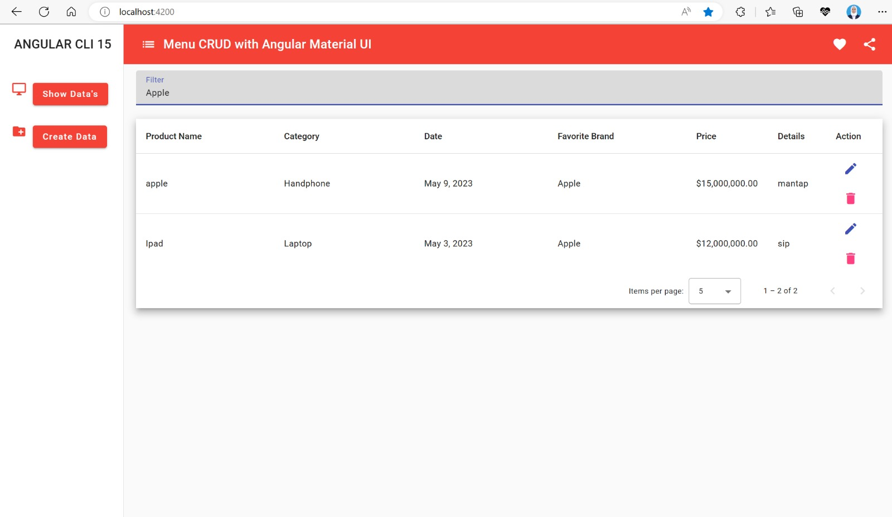

# Simple CRUD with Angular Material UI and json-server 

This project was generated with [Angular CLI](https://github.com/angular/angular-cli) version 15.1.6.

## Development server
The first run `json-server --watch db.json` to start data and then
run `ng serve` for a dev server. Navigate to `http://localhost:4200/`. The application will automatically reload if you change any of the source files.

## Build

Run `ng build` to build the project. The build artifacts will be stored in the `dist/` directory.

## Further help

To get more help on the Angular CLI use `ng help` or go check out the [Angular CLI Overview and Command Reference](https://angular.io/cli) page.

 

----
## Show Data Product
This is the page view for product data that has been added.

 

----

## Filter Data Product
If you type a word in the filter, the data will automatically appear according to the word you want.

 

----

## Pagination Data
There is a pagination feature to set the amount of data on the page.

 

----

## Add Data Product
The add page functions to add data to the product which can later be displayed in a table

 

---
## Alert Success Added
Alert will appear if the data has been successfully filled in and clicked save

The following is the result of the input data

 